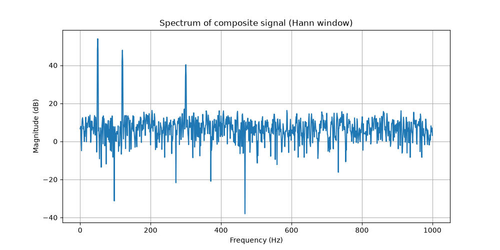

# Signal Analysis — Composite Signal Spectral Analysis (Exercise 2)

## 1. Problem

Design and analyze a composite signal made of three sinusoids plus additive
white Gaussian noise (AWGN), then verify — through spectral analysis via the
FFT — that the frequency content and relative amplitudes match what was
designed.

- Three sinusoids: 50 Hz, 120 Hz, 300 Hz
- Amplitudes: 1.0, 0.5, 0.2 (respectively)
- White Gaussian Noise added on top, mean 0, std 0.1

This exercise follows the repository's standard workflow:

```
Theory → Mathematical Model → Prediction → Implementation → Test → Experiment → Analysis → Documentation
```

---

## 2. Design Decisions

### 2.1 Sampling frequency

Which sampling frequency to choose? By definition, the Nyquist frequency is
half the sampling frequency: f_Nyquist = f_s/2. To avoid aliasing, the
sampling frequency must satisfy f_s ≥ 2·f_max = 600 Hz. In practice, since
this is not a real ADC with an expensive anti-aliasing filter, I used a
sampling frequency 4–10× larger than the maximum frequency, not just a small
safety margin over the Nyquist limit, because oversampling also improves the
visual resolution of the spectrum and leaves margin so that the
highest-frequency tone does not sit at the edge of the plot. Based on this,
I chose f_s = 2000 Hz, approximately 6.7× the maximum frequency.

### 2.2 Observation window duration

Which duration should the observation window have? The most restrictive
pair is 50–120 Hz, only 70 Hz apart. Spectral resolution is defined by
Δf = 1/T: the longer T is, the finer the resolution becomes, since the
frequency bins get closer together. Theoretically, the minimum required
duration is T = 0.0143 s, but this sits right at the limit for the closest
pair, leaving the resulting peaks poorly separated with no margin. Since the
Hann window widens the main lobe by approximately 2× compared to a
rectangular window, extra margin above that minimum is required. For this
reason, and since this is a didactic analysis, I chose T = 1 s, giving
Δf = 1 Hz — a wide margin that clearly resolves all three tones.

### 2.3 Window function

Which window should be selected? There are two options: Hann or rectangular
(no window). If a rectangular window is used, the risk of spectral leakage
increases, because the FFT assumes the signal repeats indefinitely, and the
rectangular window abruptly cuts the signal at its boundaries, introducing a
discontinuity. This gives the rectangular window a narrower main lobe
(better frequency resolution) but higher side lobes (more leakage). The Hann
window trades this off: it widens the main lobe by approximately 2×, but
greatly reduces the side lobes, containing the leakage. In this case, the
amplitudes are very different (1.0 vs 0.2), so leakage from the strongest
tone could mask the weakest one under a rectangular window. Since T = 1 s
already provides a wide margin (Δf = 1 Hz), the wider main lobe of the Hann
window can be afforded without sacrificing the ability to resolve all three
tones. For this reason, the Hann window was chosen.

---

## 3. Final Parameters

| Parameter | Value | Justification |
|---|---|---|
| `f_sampling` | 2000 Hz | ~6.7× f_max, Nyquist + oversampling margin |
| `T` | 1 s | Δf = 1 Hz, wide margin above the 0.0143 s theoretical minimum |
| Window | Hann | Contains leakage given the 1.0 vs 0.2 amplitude disparity |
| Sine frequencies | 50, 120, 300 Hz | Given |
| Sine amplitudes | 1.0, 0.5, 0.2 | Given |
| Noise | AWGN, μ=0, σ=0.1 | Standard white noise model used in signal processing |

---

## 4. Implementation

```python
import numpy as np
import matplotlib.pyplot as plt

# --- Signal parameters ---
f_sampling = 2000          # Sampling frequency (Hz)
f_sine1 = 50                # Sine 1 frequency (Hz)
f_sine2 = 120               # Sine 2 frequency (Hz)
f_sine3 = 300               # Sine 3 frequency (Hz)
m_sine1 = 1.0                # Sine 1 amplitude
m_sine2 = 0.5                # Sine 2 amplitude
m_sine3 = 0.2                # Sine 3 amplitude
T = 1                        # Duration of the observation window (seconds)

N = int(f_sampling * T)      # Total number of samples

# --- Time vector ---
t = np.arange(N) / f_sampling   # Sample instants: n/fs for n = 0, 1, ..., N-1

# --- Composite signal ---
sine_1 = m_sine1 * np.sin(2*np.pi*f_sine1*t)   # Sine 1 wave
sine_2 = m_sine2 * np.sin(2*np.pi*f_sine2*t)   # Sine 2 wave
sine_3 = m_sine3 * np.sin(2*np.pi*f_sine3*t)   # Sine 3 wave

noise = np.random.normal(0, 0.1, size=N)        # AWGN
comp_signal = sine_1 + sine_2 + sine_3 + noise  # Signal with 3 sines and AWGN

# --- Windowing ---
window = np.hanning(N)                    # Hann window, size N
windowed_signal = window * comp_signal    # w[n] * x[n]

# --- Spectral analysis ---
spectrum = np.fft.rfft(windowed_signal)             # Real FFT
freqs = np.fft.rfftfreq(N, d=1/f_sampling)           # Frequency axis (Hz)

magnitude = np.abs(spectrum)                         # Magnitude (real + imaginary combined)
magnitude_db = 20 * np.log10(magnitude + 1e-12)      # Magnitude in dB (epsilon avoids log(0))

# --- Plot ---
plt.figure(figsize=(10, 5))
plt.plot(freqs, magnitude_db)
plt.xlabel("Frequency (Hz)")
plt.ylabel("Magnitude (dB)")
plt.title("Spectrum of composite signal (Hann window)")
plt.grid(True)
plt.show()
```

---

## 5. Prediction (before running)

- The three peaks should appear at exactly 50 Hz, 120 Hz, and 300 Hz — the
  frequencies the signal was built from.
- Peak heights should follow the amplitude order: 50 Hz (highest, amplitude
  1.0) > 120 Hz (amplitude 0.5) > 300 Hz (lowest, amplitude 0.2).
- The rest of the spectrum should not be silent: since AWGN has energy
  spread across all frequencies by definition, a low, irregular noise floor
  is expected across the whole spectrum, well below the three peaks.

---

## 6. Result



The measured spectrum matches the prediction:

- Peaks appear at ~50 Hz (~54 dB), ~120 Hz (~48 dB), and ~300 Hz (~40 dB).
- Peak height order matches the amplitude order: the 50 Hz tone has the
  largest amplitude among the three sinusoids, producing the highest peak;
  the 300 Hz tone has the smallest amplitude, producing the lowest peak.
- A noise floor is visible across the entire spectrum (roughly 0–15 dB),
  never reaching -∞ dB, because Gaussian white noise was added directly to
  the signal in code, simulating what AWGN would look like in a real
  channel.
- Each peak shows a slightly widened base rather than a perfectly thin
  line — the expected effect of the Hann window's ~2× wider main lobe,
  the trade-off accepted in section 2.3 in exchange for reduced leakage.

---

## 7. Open Questions / Next Steps

- Design and apply a Butterworth band-pass filter to isolate one of the
  three tones.
- Compare `scipy.signal.filtfilt` (zero-phase) vs `scipy.signal.lfilter`
  (causal, phase-shifted) on the filtered signal.
- Compute and validate the SNR of the composite signal, before and after
  filtering.